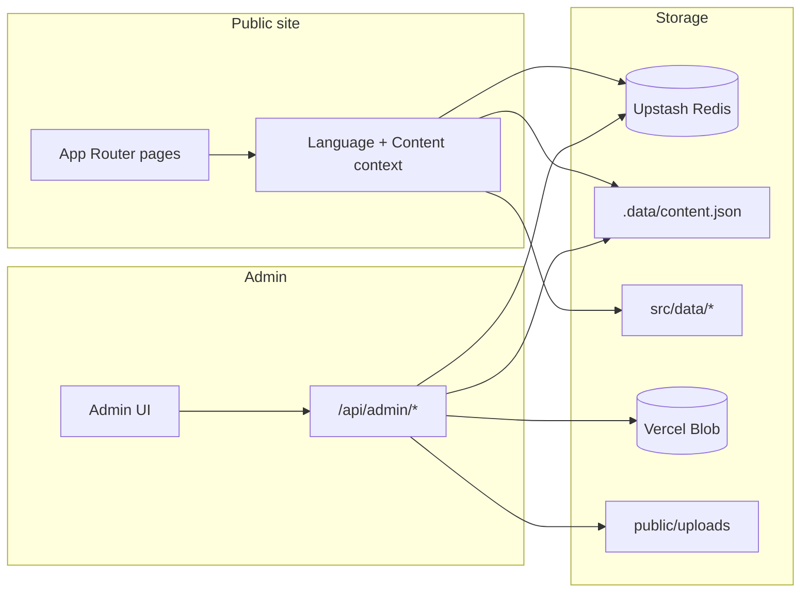

# Sapir Cohen · Architecture & Interior Design

Production portfolio and content platform for **Sapir Cohen**, architectural technologist and interior designer. The public site is bilingual (Hebrew RTL and English LTR). A password-protected admin panel lets you edit copy, projects, services, and visual theme without touching code.

**Production:** [sapir-cohen-portfolio.vercel.app](https://sapir-cohen-portfolio.vercel.app)  
**Stack:** Next.js on Vercel · Upstash Redis · Vercel Blob

## At a glance

| | |
|---|---|
| **Public site** | Portfolio, services, about, contact, legal pages, accessibility toolbar |
| **Languages** | Hebrew and English with saved preference |
| **CMS** | `/admin` with projects, texts, theme, services, and project types |
| **Content** | Redis in production, local JSON in dev, seed data as fallback |
| **Media** | Vercel Blob in production, `public/uploads` locally, WebP pipeline for static assets |

## Table of contents

1. [Public site](#public-site)
2. [Admin panel](#admin-panel)
3. [Accessibility and legal](#accessibility-and-legal)
4. [Tech stack](#tech-stack)
5. [Architecture](#architecture)
6. [Getting started](#getting-started)
7. [Environment variables](#environment-variables)
8. [Content storage](#content-storage)
9. [Image uploads](#image-uploads)
10. [Project structure](#project-structure)
11. [Seed data](#seed-data)
12. [Scripts](#scripts)
13. [Deployment](#deployment)
14. [Troubleshooting](#troubleshooting)

## Public site

### Home

- **Hero** always displays the brand in English: *Sapir Cohen* and *Architecture & Interior Design*, regardless of the active site language.
- **Portfolio grid** with cover images, featured projects, and links to full project pages.
- **Project types** section with configurable labels in both languages.
- **Service packages** with a card layout on desktop and a compact comparison table on mobile.
- **Contact** section with inquiry form, project type selection, WhatsApp link, and inline privacy consent.

### Project pages

Route: `/projects/[slug]`

Each project supports a cover image, thumbnail, bilingual name and description, location, gallery with captions, optional before/after or render groups, and a keyboard-accessible lightbox.

### About

Route: `/about`

Personal introduction, credentials, and portrait image (editable in admin).

### Language switching

The header language toggle switches between Hebrew and English. Direction (`rtl` / `ltr`), typography, and copy update immediately. The choice is stored in `localStorage`.

### SEO and metadata

- Dynamic page titles and descriptions from CMS copy
- Open Graph and canonical URLs via `NEXT_PUBLIC_SITE_URL`
- JSON-LD structured data
- Auto-generated `sitemap.xml`

## Admin panel

All admin routes except login, logout, and health check require a signed session cookie.

| Route | Purpose |
|-------|---------|
| `/admin/login` | Password login |
| `/admin` | Dashboard with storage status |
| `/admin/projects` | Projects CRUD, cover, thumbnail, galleries, reorder |
| `/admin/texts` | Site copy by section (hero, portfolio, services, contact, about, legal) |
| `/admin/theme` | Colors, borders, buttons, hero, cards, featured package styling |
| `/admin/services` | Three service tiers, descriptions, highlights |
| `/admin/types` | Home page project type list |

### Editing workflow

1. Log in at `/admin/login`.
2. Open the relevant section.
3. Edit fields (most text fields have Hebrew and English versions).
4. Click **Save changes** at the bottom of the page.

Changes persist to Redis in production or to `.data/content.json` locally, then appear on the public site after refresh.

### Site texts editor

The texts admin uses a **section picker** so you edit one area at a time instead of one long document:

- General (brand, nav, SEO, footer)
- Hero
- Portfolio and CTA band
- Services
- Contact
- About
- Legal pages (privacy, accessibility, terms, cookies)

The JSON editor supports collapsible groups, **collapse all / expand all** for long lists, image upload fields, and array items with add, reorder, and delete.

### Theme editor

Adjust site-wide visual tokens: ink and text colors, surfaces, borders, shadows, hero panel, buttons, cards, and the featured service package accent. Theme data is stored under the `siteTheme` content key.

### Sessions and password

- Sessions last 7 days in an HTTP-only cookie signed with `ADMIN_SESSION_SECRET`.
- Changing `ADMIN_PASSWORD` invalidates existing sessions after redeploy.
- Log out from `/admin/login` to clear the cookie immediately.

## Accessibility and legal

### Accessibility toolbar

Fixed button at the bottom-left of every page. Features:

- Text size in three levels (A− / A+)
- High contrast mode
- Link underlining
- Readable font
- Text-to-speech for selection or main content (browser dependent)
- Reset preferences (saved in the browser)
- Link to the accessibility statement

### Legal pages

| Page | Route |
|------|-------|
| Privacy Policy | `/privacy-policy` |
| Accessibility Statement | `/accessibility` |
| Terms of Use | `/terms-of-use` |
| Cookies Policy | `/cookies` |

Legal copy lives in `src/data/legalCopy.ts` and is editable from the texts admin. The contact form opens the privacy policy in an accessible modal.

### Other accessibility features

- Skip link to main content
- Keyboard navigation and visible focus states
- RTL and LTR support
- Reduced motion when requested in system settings
- Lightbox and legal dialogs closable by keyboard

## Tech stack

| Area | Technology |
|------|------------|
| Framework | Next.js 15 (App Router) |
| UI | React 19 |
| Language | TypeScript 5 |
| Styling | Tailwind CSS 3.4, custom CSS variables, admin UI styles |
| Fonts | Heebo, Outfit, Plus Jakarta Sans, Josefin Sans via `next/font` |
| Auth | `jose` (signed session cookie) |
| Content | Upstash Redis (`@upstash/redis`) |
| Images | Vercel Blob (`@vercel/blob`), `sharp` for optimization scripts |
| Lint | ESLint 9 + eslint-config-next |

## Architecture



**Content keys:** `siteCopy`, `projects`, `services`, `projectTypes`, `siteTheme`

**API:** `GET` and `PUT` on `/api/admin/content/[key]`

## Getting started

### Prerequisites

- Node.js 18.18 or newer (20+ recommended)
- npm

### Install and run

```bash
npm install
cp .env.example .env.local
# Edit .env.local (at minimum ADMIN_PASSWORD and ADMIN_SESSION_SECRET)
npm run dev
```

Open [http://localhost:3000](http://localhost:3000). If port 3000 is busy, Next.js picks the next available port.

Clear the Next.js cache and restart:

```bash
npm run dev:clean
```

### Production build locally

```bash
npm run build
npm start
```

## Environment variables

Copy `.env.example` to `.env.local` for development. Set the same values in **Vercel → Project → Settings → Environment Variables** for production.

| Variable | Required | Purpose |
|----------|----------|---------|
| `ADMIN_PASSWORD` | Yes (admin) | Login password for `/admin` |
| `ADMIN_SESSION_SECRET` | Yes (admin) | Cookie signing secret. Generate with `openssl rand -base64 32` |
| `UPSTASH_REDIS_REST_URL` | Production | Redis REST URL for content |
| `UPSTASH_REDIS_REST_TOKEN` | Production | Redis token (`KV_REST_API_*` aliases also work) |
| `BLOB_STORE_ID` | Production | Vercel Blob store ID |
| `BLOB_READ_WRITE_TOKEN` | Optional | Legacy direct browser upload token |
| `BLOB_ACCESS` | Production | `public` or `private`. Must match store type |
| `NEXT_PUBLIC_BLOB_ACCESS` | Production | Same as `BLOB_ACCESS` for client uploads |
| `NEXT_PUBLIC_SITE_URL` | Production | Canonical site URL for SEO and sitemap |

**Local dev without Redis or Blob:** content saves to `./.data/content.json`. Images save to `./public/uploads/`.

**After any env change on Vercel:** redeploy the project.

### Password vs session secret

- `ADMIN_PASSWORD` is what you type on the login page.
- `ADMIN_SESSION_SECRET` is a server-only random string. Users never see it.

## Content storage

```
Production (Vercel)     →  Upstash Redis
Local development       →  ./.data/content.json
Fallback (always)       →  Built-in seed from src/data/*
```

On load, stored content is merged with seed data so new fields added in code still appear even if Redis holds an older snapshot.

## Image uploads

### Production (Vercel)

- Uploads go to **Vercel Blob** under `uploads/`.
- **New stores** use OIDC: `BLOB_STORE_ID` plus auto-injected `VERCEL_OIDC_TOKEN` on Vercel. No manual token needed.
- **Legacy stores** may expose `BLOB_READ_WRITE_TOKEN` for direct browser uploads.
- Large photos are compressed in the browser before upload (WebP, max 2400px).
- OIDC-only setups upload via the server after compression (typically under 4.5 MB).
- **Private Blob stores:** URLs are proxied through `/api/blob` for public display.

### Local development

- Without Blob credentials, files save to `public/uploads/`.
- `BLOB_STORE_ID` alone is not enough locally. Add `BLOB_READ_WRITE_TOKEN` or rely on local uploads.

### Gallery items in admin

Each gallery entry must be an object:

```json
{
  "src": "https://example.com/image.webp",
  "caption": { "he": "כותרת", "en": "Caption" }
}
```

Use **+ Add item** in the gallery section, then **Upload image**.

## Project structure

```
src/
  app/
    (site)/                    Public pages
      page.tsx                 Home
      about/
      projects/[slug]/
      privacy-policy/ accessibility/ terms-of-use/ cookies/
    admin/                     CMS UI
      login/ projects/ texts/ theme/ services/ types/
    api/
      admin/                   Auth, content, upload, blob token, health
      blob/                    Private blob proxy
  components/
    a11y/                      Accessibility toolbar, skip link
    admin/                     SiteCopyEditor, JsonEditor, ThemeEditor, …
    layout/ sections/ legal/ ui/ seo/
  context/                     Language and dynamic content
  data/                        Seed content and legal copy
  lib/                         content, store, seed, session, upload, SEO, theme
  types/                       Shared TypeScript types
  middleware.ts                Protects /admin and /api/admin
public/
  images/portfolio/<slug>/     Static portfolio WebP assets
  uploads/                     Local dev uploads
.data/
  content.json                 Local dev content store
scripts/
  optimize-images.mjs          WebP conversion and thumbnails
  import-neve-yam.mjs          Project image import helper
```

## Seed data

Built-in defaults in `src/data/` apply until the CMS store has data:

| File | Content |
|------|---------|
| `siteCopy.ts` | Nav, hero, about, contact, footer, CTA labels |
| `legalCopy.ts` | Privacy, accessibility, terms, cookies |
| `projects.ts` | Project summaries |
| `projectGalleries.ts` | Gallery and render images per slug |
| `services.ts` | Service packages |
| `projectTypes.ts` | Project type labels |
| `siteTheme.ts` | Default colors, borders, and component tokens |
| `imageMeta.ts` | Width, height, and blur placeholders for images |

Update `CONTACT_EMAIL` and WhatsApp details in `siteCopy.ts` for seed defaults.

## Scripts

| Command | Description |
|---------|-------------|
| `npm run dev` | Development server |
| `npm run dev:clean` | Remove `.next` cache and start dev |
| `npm run build` | Production build |
| `npm start` | Run production build locally |
| `npm run lint` | ESLint |
| `npm run optimize-images` | Convert portfolio images to WebP and generate thumbnails |
| `npm run optimize-hero-covers` | Optimize cover images only |
| `npm run optimize-images:clean` | Optimize and delete originals |
| `npm run import-neve-yam` | Import and prepare Neve Yam project images |

### Static image workflow

1. Place source files in `public/images/portfolio/<slug>/` or use the import script.
2. Run `npm run optimize-images`.
3. Register paths in `projectGalleries.ts` and `imageMeta.ts` if needed.

Expected cover path: `public/images/portfolio/<slug>/cover.webp`

## Deployment

1. Push to GitHub.
2. Import the repository in Vercel.
3. Set environment variables for Production (and Preview if needed).
4. Connect **Upstash Redis** and **Vercel Blob** under Vercel Storage.
5. Set `BLOB_ACCESS=public` and `NEXT_PUBLIC_BLOB_ACCESS=public` for a public Blob store.
6. Set `NEXT_PUBLIC_SITE_URL` to your production domain.
7. Deploy.

Verify locally before shipping:

```bash
npm run build
npm start
```

## Troubleshooting

| Issue | What to try |
|-------|-------------|
| Old admin password still works | Log out on `/admin/login` or clear site cookies. Redeploy after env changes. |
| New password rejected | Redeploy after changing `ADMIN_PASSWORD`. In Vercel, enter the value without quotes. |
| Upload fails | Confirm Blob is connected. Check `BLOB_STORE_ID` and `BLOB_ACCESS`. Redeploy. |
| Site shows old content | Click **Save changes** in admin. Confirm Redis is connected in production. |
| Preview differs from production | Set env vars for both Preview and Production scopes in Vercel. |
| No upload button in gallery | Add a gallery item with **+ Add item**. Each item needs a `src` field. |
| Internal Server Error after deploy | Run `npm run build` locally. Check exports in `src/data/legalCopy.ts` and recent admin saves. |
| Health diagnostics | `GET /api/admin/health` returns non-secret server status |

## License

Private project. All rights reserved · Sapir Cohen Architecture & Interior Design.
